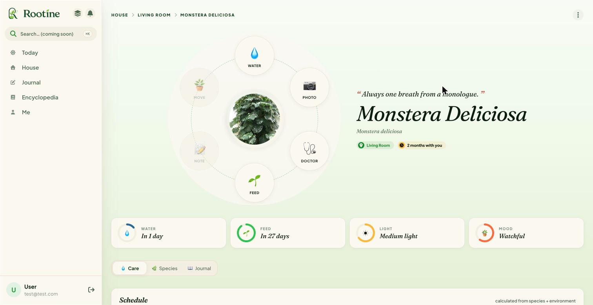
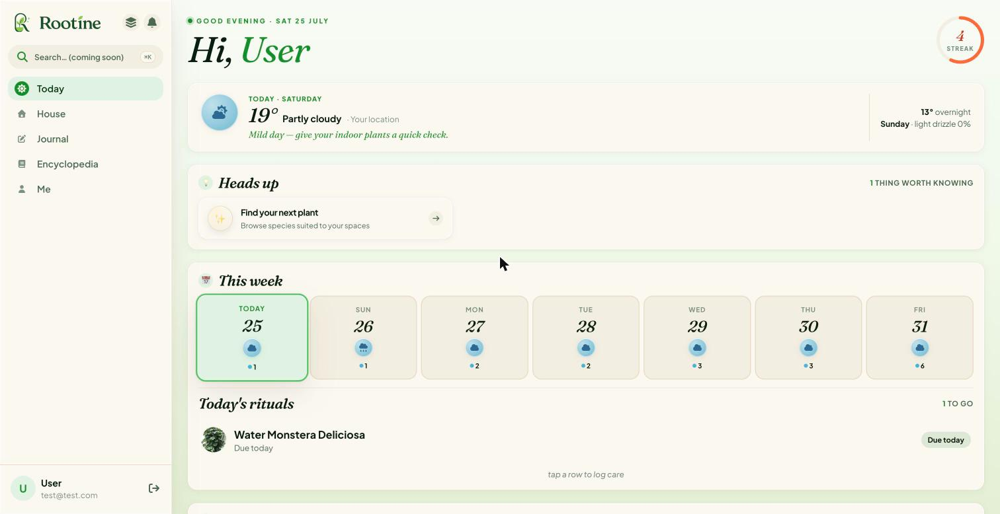
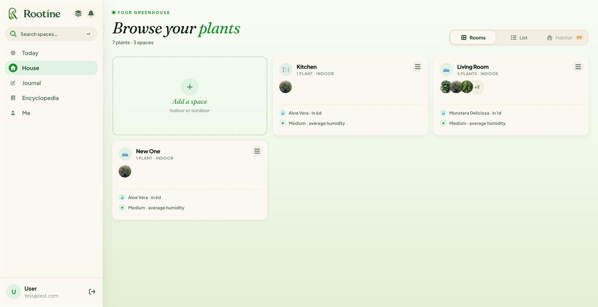
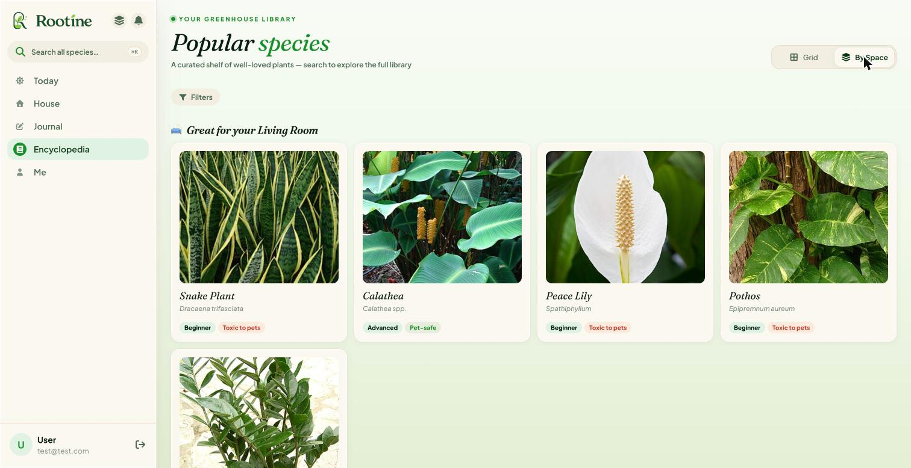
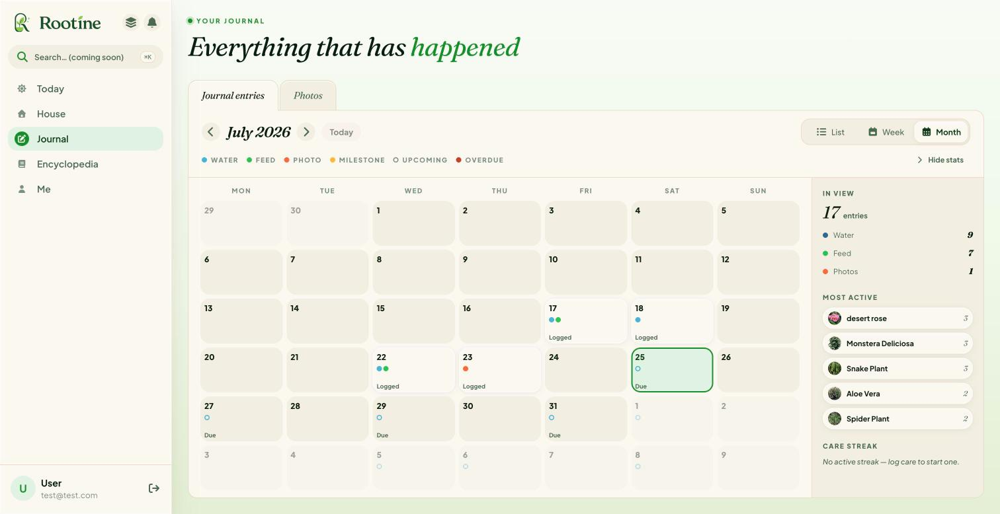

# Rootine 🌱

**Smart plant care assistant** — watering and feeding schedules that adapt to each plant's species *and* the room it actually lives in, instead of one-size-fits-all reminders.

Rails 8 API + React SPA in a monorepo. Actively developed toward a public beta.

> The codebase is named `PlantCare` for historical reasons; the app-facing brand is **Rootine** (root + routine).

## What it does

- **Environment-aware scheduling** — each plant's watering and feeding cadence is derived from its species' base needs, adjusted by the light, temperature, and humidity of the space it lives in. Users answer environment questions once *per room*, not per plant. Change a room's conditions and every plant in it reschedules automatically.
- **Space-aware recommendations** — the species encyclopedia matches plants to the user's actual rooms by light and humidity ("great for your bedroom"), turning the catalogue into buying advice.
- **Plant personality** — species carry traits (`dramatic`, `prickly`, `chill`, `needy`, `stoic`) that drive emotes, colour accents, and status copy, for a warmer, less clinical UI.
- **Species reference** — browse a curated catalogue with PostgreSQL full-text search, backed by live lookups against the Perenual API (cached to respect its rate limit).
- **Care journal** — a timeline and calendar of every watering, feeding, and photo, per plant and across the whole collection.
- **Guided onboarding** — a multi-step wizard sets up rooms and plants and seeds the first schedule.
- **Photos, achievements, notifications** — Active Storage photo uploads, milestone achievements, and an in-app notification inbox.

## Screenshots

**Plant detail** — a radial care wheel, personality-driven copy, and a schedule the server computes from species data × the plant's environment.



| Today | House |
|---|---|
|  |  |

| Encyclopedia — recommendations by space | Journal |
|---|---|
|  |  |

## Engineering highlights

- **DHH-style Rails** — fat models, skinny and nested controllers, no service-object or policy-gem sprawl. Authorization is enforced at the query layer: every request scopes through `current_user` associations, so URL tampering resolves to nothing.
- **The server owns the business logic** — schedule maths lives only in the Rails models. The client reads computed fields via `as_json` and never re-derives them, so the two can't silently drift.
- **Custom JWT auth** — a short-lived access token held in memory plus a refresh token in an httpOnly cookie, with server-side revocation.
- **Considered React data layer** — TanStack Query with a single source-of-truth query-key registry and deliberate cache-invalidation rules per mutation.
- **CI gate on every PR** — RuboCop, Brakeman, Bundler Audit, Biome, Minitest, and Playwright.

## Stack

- **Backend** — Rails 8 (API-only), PostgreSQL 17, Redis, Sidekiq, custom JWT auth
- **Frontend** — React 19, Vite, TanStack Query, React Router, Tailwind v4, Biome
- **Tests** — Minitest + fixtures (API), Vitest + Playwright (client)
- **External** — Perenual API for species data (cached, 100/day free tier)
- **Dev** — Docker Compose, host UID/GID volume mounts

## Quick start

First-time setup:

```bash
./scripts/install.sh
```

Then:

```bash
docker compose up
```

Web client at `http://localhost:5173`, API at `http://localhost:3000`.

## Scripts

| Script | Purpose |
|---|---|
| `./scripts/install.sh` | One-shot setup — generates `.env`, builds, migrates, seeds |
| `./scripts/lint.sh` | Auto-fix lint (RuboCop, Brakeman, Bundler Audit, Biome) |
| `./scripts/run_tests.sh [api\|client]` | Run test suite |
| `./scripts/reset_db.sh` | Drop, create, migrate, seed |
| `./scripts/console.sh` | Rails console |
| `./scripts/bash.sh` | Shell into API container |
| `./scripts/npm_install.sh` | Install client deps (run after `package.json` changes) |

## Repo layout

```
api/           Rails 8 API
client/        React frontend (Vite)
docs/          Plans, mockups, design specs
scripts/       Docker dev helpers
CLAUDE.md      AI collaboration instructions (project + code style)
```

## Status

Work in progress. Backend is feature-rich and fully tested; the frontend is well underway — onboarding, care scheduling, journal, notifications, achievements, and the species encyclopedia (with space-aware recommendations) all shipped. A public beta is the next milestone.

## License

MIT — see [LICENSE](LICENSE).
